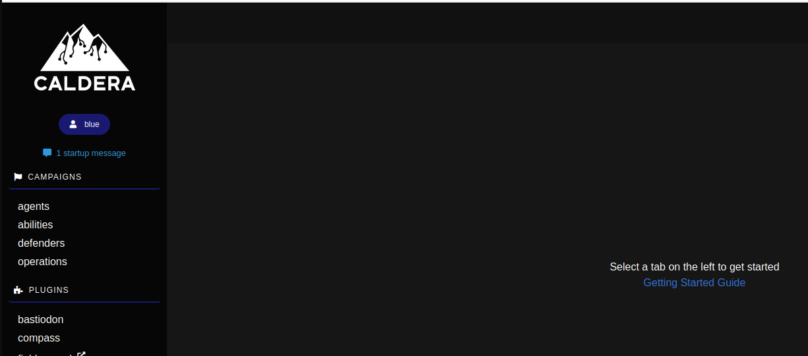
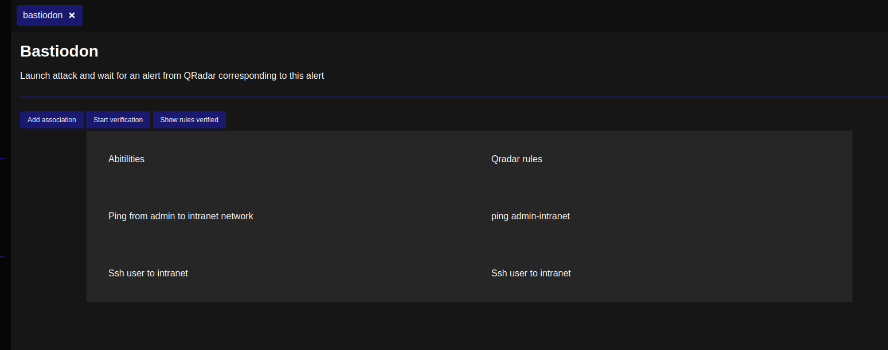

# Bastiodon

Launch attack and wait for an alert from QRadar corresponding to this alert

## Creation du plugin

Pour créer le plugin il faut se baser sur ce repo : https://github.com/mitre/skeleton
C'est un skelette de plugin qui contient aussi (légèrement) la documentation pour développer le plugin. 

## Installation

### La version utilisé de Caldera est la 4.2.0, la version 5 introduit une refonte majeure du front avec des changements de framework ce qui rend le plugin actuel incompatible

Le dossier bastiodon se place dans le dossier plugins du serveur Caldera.  
Pour activer le plugin Bastiodon sur Caldera, il ajouter `bastiodon` dans la liste des plugins dans le fichier local.yml dans le dossier conf/  

Exemple :  

```
plugins:
- bastiodon
- atomic
- compass
- debrief
```

Pour fonctionner, le plugin a besoin des 2 variables d'environnement suivantes :  
`qradar_ip` et `qradar_token`.  
  

`qradar_ip` correspond à l'url du serveur Qradar.  
Exemple : `qradar_ip=https://10.10.10.240`.  
  

`qradar_token` correspond au token généré par l'adminstrateur dans Qradar afin d'autoriser le plugin Bastiodon a effectuer des appels API vers Qradar.  
Exemple : `qradar_token=aaaaa-aaa-aaa-aa-aaa`

Le service account a besoin d'accèder au endpoints suivant :
- GET `/api/siem/offenses`
- GET `/api/analytics/rules`
  
## Accès au plugin depuis la WebUI Caldera

Le plugin est accessible pour l'utilisateur blue (un plugin doit être configuré pour être utilisé par l'utilisateur red ou blue).  

Le plugin est disponible dans la liste des plugins de l'utilisateur blue :



La page d'accueil du plugin ressemble à ceci :



Depuis cette page il est possible de voir les associations actuelles entre une ability de Caldera et une règle Qradar, de créer une association, de lancer le processus de vérification de non-régression des réègles Qradar ainsi que de voir les règles qui ont fonctionné.

## Utilisation du plugin

L'objectif est de déployer Caldera avec le plugin déjà activé. Une fois déployé, il faut installer les agents sur les cibles de tests.

Il faut ensuite définir des abilities dans caldera et créer (si ce n'est pas déjà fait) la règle dans QRadar.

Enfin, dans le plugin Bastiodon, il faut faire les associations entre une ability Caldera et une règle QRadar. On peut ensuite lancer la vérification des règles depuis l'interface Bastiodon ou par un call API.
Le rapport de vérification est accessible depuis l'interface ou par un call API.

### Limitations

Le plugin n'est pas entièrement fini.

L'enregistrement des associations c'est pas fonctionnel ainsi que le lancement des attaques.
Cependant la vérification des règles et un rapport sont disponnibles, bien qu'il fasse lancer les attaues manuellement.

La vérification des alertes est asser primitive, il faudrait affiner la détection pour éviter les faux positif et faire du nétoyage dans les offences après la vérification.

## Fichiers utilisés pour créer le plugin

La structure d'un plugin Caldera suit le modèle SVC.
Le front HTML est situé dans `templates/bastiodon.html`.

Le fichier `hook.py` permet de créer de nouveaux endpoints HTTP destinés pour le plugin Bastiodon.  

Les APIs python associées à chaque route du fichier `hook.py` sont définies dans le fichier `app/bastiodon_api.py`. Chaque API de ce fichier fait appel à un service situé dans `app/bastiodon_svc.py`

Le fichier `app/bastiodon_gui.py` permet de fournir la page HTML du plugin.  

le fichier `app/qradar/api.py` sert à réaliser les appels APIs vers le serveur Qradar.

Les frameworks utilisés par Caldera (avant version 5.x) au niveau du front sont Alpine.js pour le javascript et Bulma pour le CSS.
